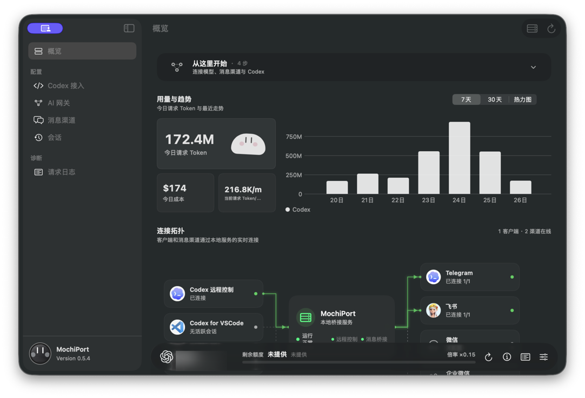
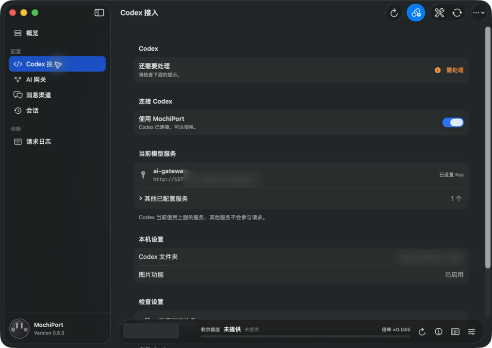
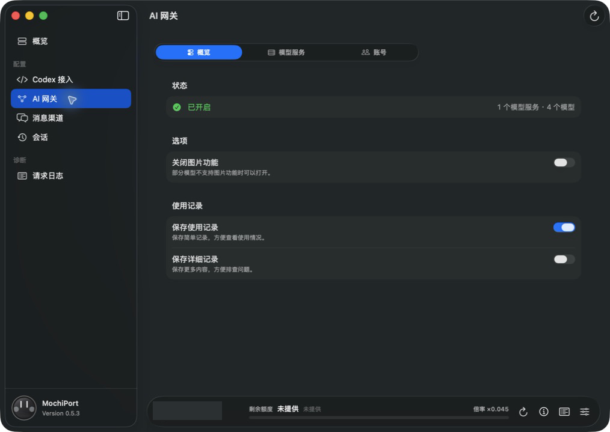
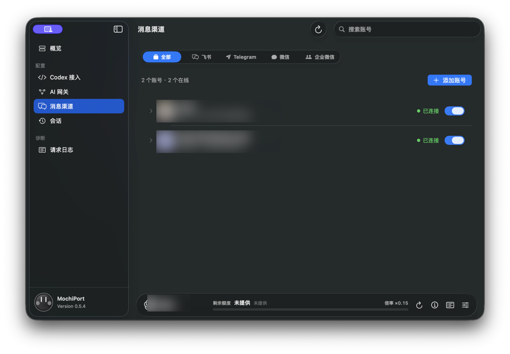
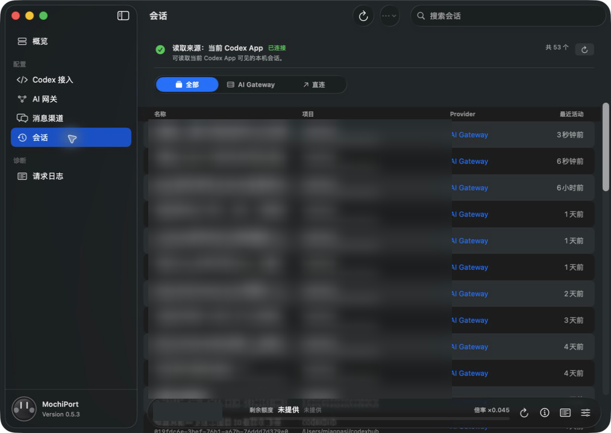
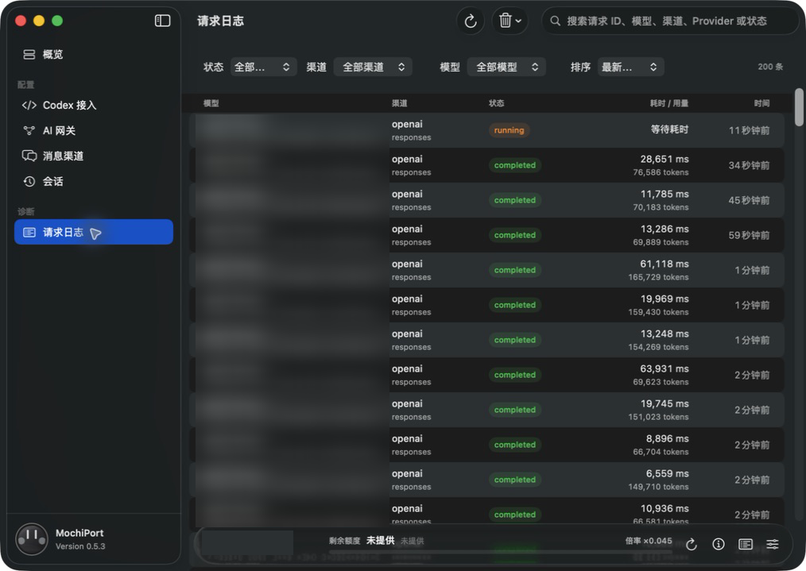

# MochiPort

[English](README.en.md)

> 当前版本：`0.5.4`

MochiPort 是一个本地优先的 Codex 会话中继。它把 Codex App、Codex VS Code 插件和 Codex CLI 接到 Telegram、飞书、微信或企业微信，让你可以在消息软件里创建会话、跟进任务和处理审批。

MochiPort 还内置 AI Gateway：Codex 只连接一个本地入口，模型请求再按配置转发到 OpenAI、DeepSeek、Grok/xAI、Anthropic/Claude、智谱 GLM 或其它兼容服务。

## 能做什么

- 通过官方 remote-control 接入 Codex App、VS Code 插件和 Codex CLI，不替换 Codex 文件，也不安装包装命令。
- 在消息软件中创建、恢复和操作 Codex thread，接收进度并处理审批。
- 在 GUI 中管理模型服务、模型别名、路由、请求日志和消息渠道。
- 只读查看 Sub2API 账号池的在线状态、倍率和最近命中账号，不修改账号池。

## 界面预览

以下截图保留完整的 macOS 窗口边界和投影；示例中的账号、路径和请求内容已做模糊处理。

<table>
  <tr>
    <td align="center"><strong>概览</strong><br></td>
    <td align="center"><strong>Codex 接入</strong><br></td>
  </tr>
  <tr>
    <td align="center"><strong>AI 网关</strong><br></td>
    <td align="center"><strong>消息渠道</strong><br></td>
  </tr>
  <tr>
    <td align="center"><strong>会话</strong><br></td>
    <td align="center"><strong>请求日志</strong><br></td>
  </tr>
</table>

## 快速开始

### 1. 安装

从 [MochiPort Releases](https://github.com/mps233/mochiport/releases) 下载对应平台的程序：

| 平台 | 文件 | 启动方式 |
| --- | --- | --- |
| macOS | `MochiPort-<版本>-macos-<架构>.dmg` | 拖入 Applications 后打开 |
| Windows | `MochiPort-<版本>-windows-x64.msi` 或 `.zip` | 安装或直接运行 |
| Linux | `MochiPort-<版本>-linux-x86_64.AppImage` | `chmod +x` 后运行 |

打开 GUI 后，MochiPort 会启动本地 backend。macOS 使用当前用户范围的 LaunchAgent 保持 backend 运行；正常退出 GUI 不会自动重新打开窗口。

### 2. 配置模型

打开 **AI 网关**，添加一个模型服务并填写：

- 协议和 Base URL
- API Key
- 上游模型列表
- 可选的模型别名、权重和超时

Codex 侧只看到 MochiPort 暴露的模型目录。未配置 AI Gateway 时，也可以先完成消息渠道和 Codex 接入。

### 3. 接入 Codex

打开 **Codex 接入**，开启“连接 MochiPort”，再正常启动 Codex App 或 Codex VS Code 插件并开启 remote-control/“控制这台电脑”。remote-control 需要 ChatGPT 兼容的认证模式，仅 API key 认证无法启动；MochiPort 会写入本地连接配置。MochiPort 会通过本地连接读取会话，不需要复制或迁移会话文件。

如果使用 Codex CLI，保持 MochiPort GUI 运行，然后执行：

```bash
codex app-server --listen ws://127.0.0.1:3849 --remote-control
codex --remote ws://127.0.0.1:3849
```

两个命令中的端口必须一致；端口被占用时可以换成其它本地端口。

### 4. 接入消息渠道

打开 **消息渠道**，选择一个或多个渠道：

- **Telegram**：填写 BotFather token；私聊使用白名单，配置的 Forum 项目群按 Topic 分开处理。
- **飞书**：扫码创建机器人，使用 WebSocket 接收事件。
- **微信**：扫码登录微信 iLink Bot。
- **企业微信**：扫码接入 AI Bot，支持私聊和群聊文本。

每个平台可以配置多个账号，并单独启停。实际部署时建议配置 Telegram `allowedChatIds`、飞书 `allowedOpenIds`/`allowedChatIds` 等白名单。

### Telegram 项目群和话题

Telegram 不需要为每个项目、每个会话单独创建机器人。通常只需要：

- 一个 Telegram Bot；
- 每个项目一个群，并把这个群设置为 Forum（论坛）群；
- 群里的每个 Topic（话题）对应一个 Codex 会话。

这样，同一个项目的多个会话可以放在同一个群里，分别使用不同的话题。话题名称会使用 Codex 会话标题，消息也只会回到对应的话题里。以后你在 Codex 客户端改了会话名称，MochiPort 会实时同步 Telegram 话题；你在 Telegram 里改话题名称，也会实时同步回 Codex 会话。

MochiPort 会记住“哪个话题对应哪个会话”。Codex 会话被归档后，MochiPort 会每隔一段时间检查；确认归档持续约 5 分钟后，会自动删除对应的话题。Codex 会话真正消失后，也会删除对应话题。这个过程不会删除 Codex 会话本身。

名称变更会通过事件实时同步；如果某次事件因断线或重启丢失，仍会每约 5 分钟自动对账补偿。两边同时改名时，后续对账以 Codex 名称为最终结果，避免互相循环覆盖。

在项目群设置里点击“同步 / 转移 Codex 会话到 Telegram Topic”时，如果某个会话原来绑定在私聊，MochiPort 会自动解除私聊绑定、创建项目群 Topic，再绑定回同一个 Codex 会话，不会删除会话本身。同步结果会逐条显示会话标题和跳过或失败原因。

在 Telegram 里手动关闭话题，只表示暂时不让它接收消息，不会删除 Codex 会话；重新打开后可以继续使用。如果手动删除了话题，Telegram 不会单独通知机器人。MochiPort 会在定期对账时探测绑定的 Topic，确认 Topic 确实不存在后清理绑定；你下一次点击“同步 Telegram 话题”时，会为仍存在的 Codex 会话重新创建并绑定 Topic。网络错误或权限不足时不会贸然清理，也不会创建重复 Topic。

## 常用操作

- **会话**：从当前 Codex App 读取会话，创建或恢复 thread。
- **请求日志**：按状态、渠道和模型筛选请求，查看耗时、用量和错误。
- **Sub2API**：在 **AI 网关 -> 账号** 填写管理地址和 Admin API Key；MochiPort 只读账号池，不会创建、删除或编辑账号。
- **网络**：可选系统代理、直连或自定义 HTTP/SOCKS5 代理，只影响 MochiPort 的出站请求。

### Telegram 命令

| 命令 | 作用 |
| --- | --- |
| `/new` | 创建新会话 |
| `/sessions` | 查看并恢复历史会话 |
| `/status` | 查看连接、任务和队列状态 |
| `/steer <内容>` | 调整当前任务方向 |
| `/queue <内容>` | 排到当前任务之后执行 |
| `/stop` | 中断当前任务，保留会话 |
| `/exit` | 退出会话并清空队列 |
| `/help` | 查看帮助 |

任务运行时直接发送普通文字也会调整当前任务；需要稍后执行的内容使用 `/queue`。

## 安全边界

MochiPort 默认只监听本机：

```text
http://127.0.0.1:3847
```

不要把 daemon 端口暴露到公网。以下内容不要提交到 Git：

- IM Bot token、企业微信 secret、微信 token
- 模型服务 API key
- Sub2API Admin API Key
- Codex 本地认证数据

GUI 中的“恢复原来的设置”只恢复 MochiPort 写入前的 Codex 连接方式，不会卸载 Codex，也不会删除会话历史。

## 更多文档

- [配置说明](docs/configuration.md)
- [故障排查](docs/troubleshooting.md)
- [架构说明](docs/architecture.md)
- [Telegram 集成与维护边界](docs/telegram-integration.zh-CN.md)
- [微信集成与已知边界](docs/wechat-integration.zh-CN.md)
- [认证说明](docs/auth-notes.zh-CN.md)
- [构建和交接规则](docs/threadrelay-change-handoff.zh-CN.md)
- [发布检查清单](docs/release-checklist.md)

旧版本的 `ThreadRelay`、`CodexHub` 配置目录和环境变量仍会被兼容读取，用于迁移已有数据；新安装请使用 `MochiPort`、`MOCHIPORT_HOME` 和 `mochiport-*`。

## 开发

```bash
cargo fmt
cargo test
cargo build --release --features gui --bin mochiport
```

许可证：Apache-2.0。上游归属和修改声明见 [NOTICE](NOTICE)。
